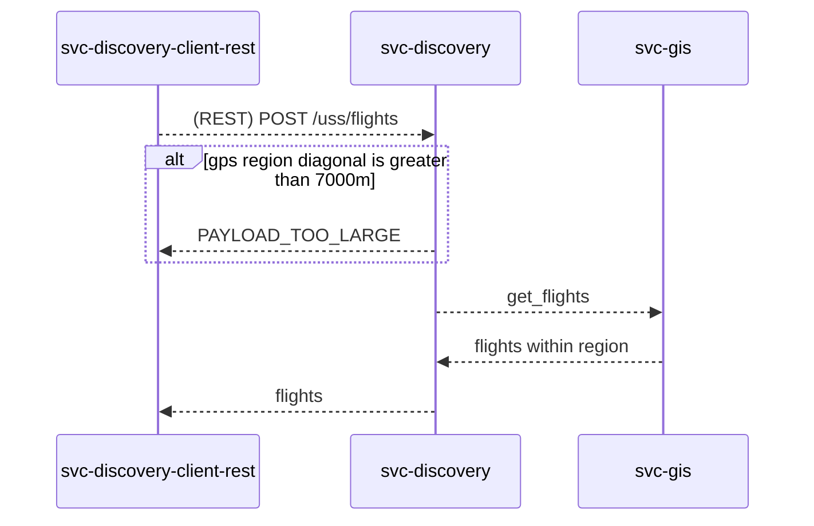

# Software Design Document (SDD) - `svc-discovery`

## :telescope: Overview

This document details the software implementation of discovery.

This microservice is the API for other service providers (U-space service providers (USSPs) as an example) to interact with the Aetheric network. Likewise, it also allows our network to make requests to external service providers to allow users to access vertiports outside of our network.

### Metadata

| Attribute     | Description                                                                    |
| ------------- |--------------------------------------------------------------------------------|
| Maintainer(s) | [@aetheric-oss/dev-realm](https://github.com/orgs/aetheric-oss/teams/dev-realm)|
| Status        | Draft                                                                          |

## :books: Related Documents

Document | Description
--- | ---
[High-Level Concept of Operations (CONOPS)](https://github.com/aetheric-oss/se-services/blob/develop/docs/conops.md) | Overview of Aetheric microservices.
[High-Level Interface Control Document (ICD)](https://github.com/aetheric-oss/se-services/blob/develop/docs/icd.md)  | Interfaces and frameworks common to all Aetheric microservices.
[Requirements - `svc-discovery`](https://nocodb.aetheric.nl/dashboard/#/nc/view/ce00646b-1776-4a72-b01a-50dcd220de2a) | Requirements and user stories for this microservice.
[Concept of Operations - `svc-discovery`](./conops.md) | Defines the motivation and duties of this microservice.
[Interface Control Document (ICD) - `svc-discovery`](./icd.md) | Defines the inputs and outputs of this microservice.

## :dna: Module Attributes

| Attribute       | Applies | Explanation                                                             |
| --------------- | ------- | ----------------------------------------------------------------------- |
| Safety Critical | ?       | |
| Realtime        | ?       | |

## :globe_with_meridians: Global Variables

## :gear: Logic

### Initialization

At initialization this service creates two servers on separate threads: a GRPC server and a REST server.

The REST server expects the following environment variables to be set:
- `DOCKER_PORT_REST` (default: `8000`)

The GRPC server expects the following environment variables to be set:
- `DOCKER_PORT_GRPC` (default: `50051`)

### Loop

As a REST and GRPC server, this service awaits requests and executes handlers.

Some handlers **require** the following environment variables to be set:
- `GIS_HOST_GRPC`
- `GIS_PORT_GRPC`

This information allows `svc-discovery` to connect to other microservices to obtain information requested by the client.

:exclamation: These environment variables will *not* default to anything if not found. In this case, requests involving the handler will result in a `503 SERVICE UNAVAILABLE`.

For detailed sequence diagrams regarding request handlers, see [REST Handlers](#mailbox-rest-handlers).

### Cleanup

None

## :mailbox: REST Handlers

### `/uss/flights` handler

This handler makes a request to the svc-gis microservice to obtain current flights for a geographic region.

If the specified geographic window is too large, the request will be rejected.

### `/demo/flights` handler

Same as the above `/uss/flights` handler, except any size window is permitted.
